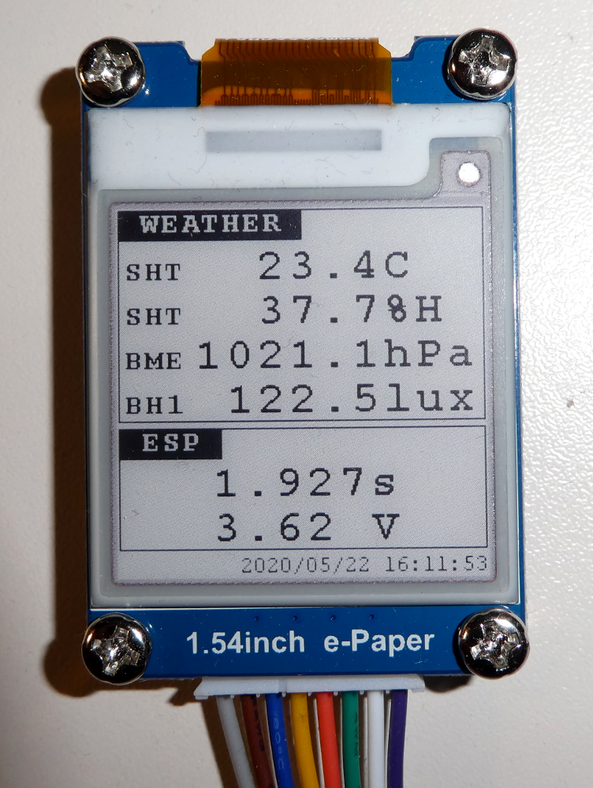

# Wettermonitor (auf einem E-Paper)

## Idee
Ursprünglich war geplant, direkt am Sensor-Modul ein Display zu betreiben. Deshalb fiel die Wahl auf ein E-Paper, auf welchem ja bekanntlich, im stromlosen Zustand, die anzuzeigenden Informationen erhalten bleiben. Konkret wurde ein [1.57"-E-Paper-Modul von Waveshare](https://www.waveshare.com/product/displays/e-paper/epaper-3/1.54inch-e-paper-module-b.htm) beschafft. Nach (...;-)...) der Lieferung des Displays musste ich dann festgestellt, dass der ESP8266 des Sensor-Moduls zu wenige frei Anschlüsse hat, einen ESP32 wollte ich aus verschiedenen Gründen nicht einsetzen. Damit das E-Paper-Modul nicht in irgendeiner Bastelkiste verstaubt, ist ein Programm für einen Raspberry Pi entstanden, an dem das Display angeschlossen ist (siehe dazu auch [Readme_EN.txt](https://github.com/boerge42/weatherstations/blob/master/esp8266/epd_weather_monitor/readme_EN.txt)...).

## Voraussetzungen
Zur Ansteuerung wurde eine [entsprechende Beispiel-Implementierung von Waveshare](https://github.com/waveshare/e-Paper) als Basis verwendet. Weiterhin müssen folgende Bibliotheken auf den Raspberry Pi installiert sein:

* wiringpi
* mosquitto
* json-c

## Funktionsweise
Das Programm empfängt die MQTT-Nachrichten des Sensor-Moduls, deren Payload folgendermaßen im JSON-Format aufgebaut sind:

    {
	"BME280":{"temperature":18.2,"humidity":34.6,"pressure_abs":1017.3,"pressure_rel":1022.2}, 
	"SHT15":{"temperature":17.3,"humidity":42.6}, 
	"TMP36":{"temperature":20.7}, 
	"BH1750":{"luminosity":76.7}, 
	"ESP":{"awake_time":1919,"vcc":3.67}
    }

Über die Aufrufparameter des Programms kann, neben den Daten zum MQTT-Broker, entschieden werden, von welchem Sensor die Temperatur, Luftfeuchtigkeit, Luftdruck und Helligkeit auf dem Display ausgegeben wird. Die Aktualisierung der angezeigten Werte erfolgt azyklisch zum Empfang der MQTT-Nachrichten, die Empfangszeit der angezeigten MQTT-Nachricht wird auf dem Display rechts unten ausgegeben. Das Aktualisierungsintervall kann ebenfalls via Kommandozeilenparameter festgelegt werden.

    epd_weather_monitor [-h <mqtt-host>]       [-p <mqtt-port>]
                    [-U <mqtt-user>]           [-P <mqtt-pwd>]
                    [-i <mqtt-id>]             [-r <display-refresh (sec)>]
                    [-T <JSON-key temperature] [-t <JSON-value temperature>]
                    [-L <JSON-key luminosity]  [-l <JSON-value luminosity>]
                    [-M <JSON-key humidity]    [-m <JSON-value humidity>]
                    [-S <JSON-key pressure]    [-s <JSON-value pressure>]
                    [-A <JSON-key awake_time]  [-a <JSON-value awake_time>]
                    [-V <JSON-key Vcc]         [-v <JSON-value Vcc>]
                    [-d]

Sinnvollerweise richtet man dieses Programm als Service auf dem Raspberry Pi ein, damit es beim Hochlauf des Rechners automatisch gestartet wird (via *systemd* siehe epd_weather_monitor.service).

## Bild
E-Paper mit entsprechenden Ausgaben:

---------
Have fun!

Uwe Berger; 2020
