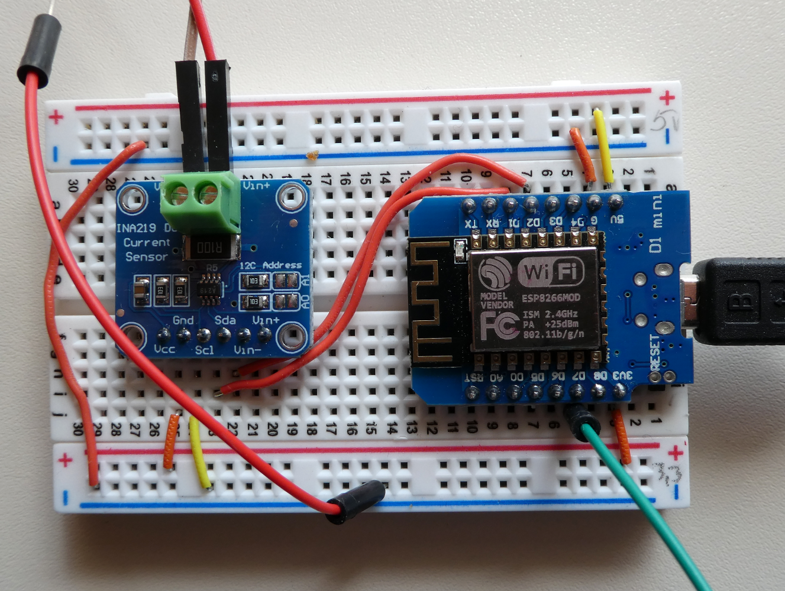
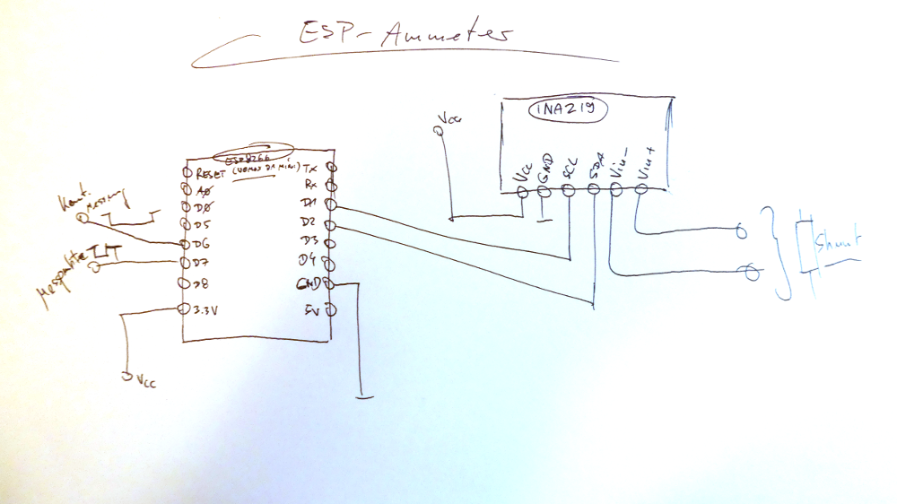
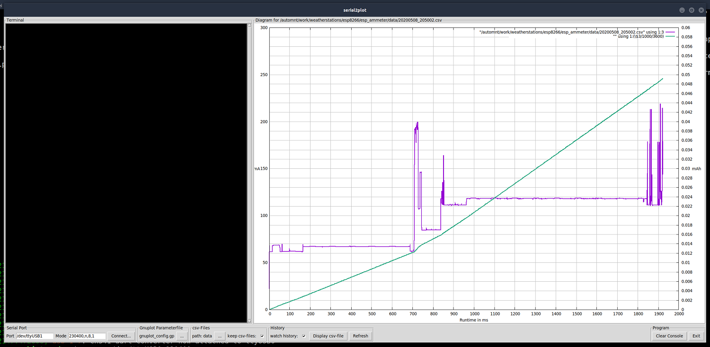

# Ampere-Meter (zur Messung der Stromaufnahme des Sensor-Moduls)

## Idee
Eines der Ziele dieses Projektes ist es, das Sensor-Modul mittels Batterie (Akku) und einem Solarpanel mit Strom zu versorgen. Um den Stromverbrauch der Schaltung und der Firmware schrittweise optimieren zu können, wurde ein Stromverbrauchsmessgerät, auf Basis eines [INA219-Moduls](https://learn.adafruit.com/adafruit-ina219-current-sensor-breakout?view=all) aufgebaut und implementiert. Als Verarbeitungseinheit wurde wieder ein ESP8266 verwendet. Mittels dieses Moduls wird die Stromaufnahme des Messobjektes im 1ms-Takt ermittelt und über die serielle Schnittstelle des ESP8266 im csv-Format ausgegeben. Der Messbeginn (und der Beginn interessanter Programmabschnitte während der Verarbeitung innerhalb der zu untersuchenden Schaltung/Firmware) werden über Impulse, welche vom Messobjekt erzeugt werden, getriggert. 

Die Verarbeitung und Visualisierung der empfangenen Messreihen erfolgt über ein Tcl/Tk-Script (serial2plot.tcl). Dieses Script stellt die, über die serielle Schnittstelle empfangenen, Daten in einem Diagramm dar, welches mittels [*gnuplot*](http://www.gnuplot.info/), [inline als Canvas-Widget](http://wiki.bralug.de/Tcl/Tk-Benutzeroberfl%C3%A4chen_f%C3%BCr_gnuplot_programmieren), generiert wird. Die dazu verwendeten gnuplot-Parameterdateien können in der Oberfläche von *serial2plot* ausgewählt werden. Weiterhin werden, wenn gewünscht, die Messreihen in einzelnen CSV-Dateien gesichert und können später nochmal als Diagramm visualisiert werden. Die Oberfläche von *serial2plot* ist recht einfach gehalten und sicherlich noch verbesserbar, hat aber in der vorliegenden Version gute Dienste geleistet und vollkommen ausgereicht....

## Bilder

Ampere-Meter auf einem Breadboard aufgebaut:

Skizze Schaltplan:

Screenshot Bedienoberfläche *serial2plot*:

---------
Have fun!

Uwe Berger; 2020
