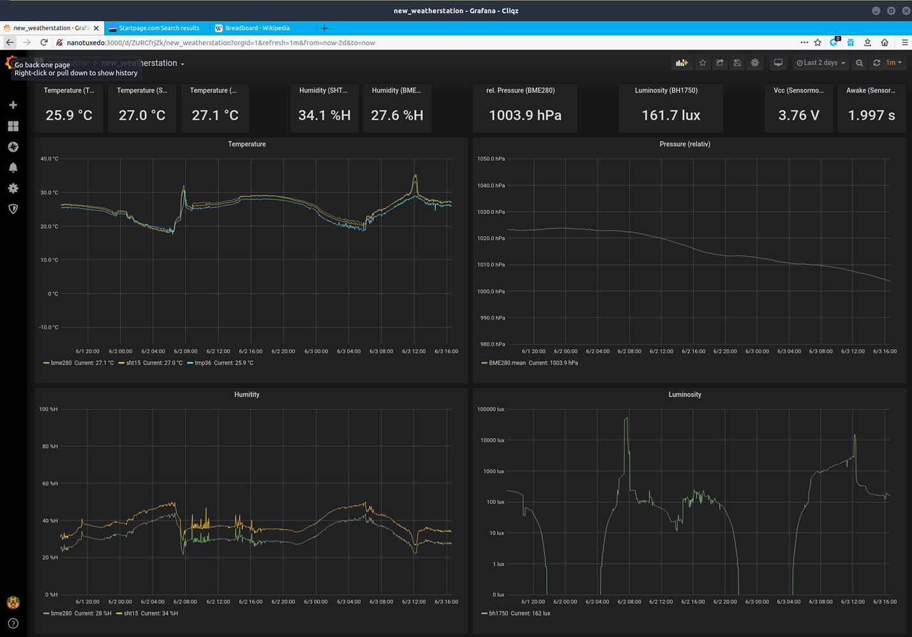

# Wifi-Sensormodul auf ESP8266-Basis

Nachdem ich jahrelang das Sensormodul via ISM-Band (RFM12-Module) an die Basisstation angebunden hatte, war es an der Zeit mit moderneren Methoden der Datenübertragung zu experimentieren. Am naheliegendsten ist es dabei WLAN zu verwenden, zumal mit dem ESP8266 (und auch seinem Nachfolger, dem ESP32) eine entsprechende Hardwareplattform zur Verfügung steht. Bei diesen Experimenten sind folgende Dinge entstanden:

- [das eigentliche Sensor-Modul](sensor_modul/)
- kleiner Wettermonitor mit E-Paper als Display (für [Raspberry Pi](epd_weather_monitor/), [ESP8266](esp_epaper_weather_monitor/))
- [ein Ampere-Meter, zur Aufzeichnung der Stromaufnahme des Sensor-Moduls](esp_ammeter/)

## Blockschaltbild des Systems
Das Sensor-Modul sendet die ermittelten Messwerte an einen MQTT-Broker. Den entsprechenden MQTT-Topic hat ein [NodeRed-Flow](nodered/) abonniert, in welchem der Payload der Nachricht für eine InfluxDB aufbereitet und an diese gesendet wird. Weiterhin bezieht auch der Wettermonitor die anzuzeigenden Daten vom MQTT-Broker.

    +-------------+    +-------------+    +----------+    +---------------+
    |             |    |             |    | NodeRed  |    |               |
    | Sensormodul |--->| MQTT-Broker |--->|   oder   |--->|   InfluxDB    |
    |             |    |             |    | Telegraf |    |               |
    +-------------+    +-------------+    +----------+    +---------------+
                              |                                   |
                              V                                   V
                       +-------------+                    +---------------+
                       |   E-Paper-  |                    | Visualsierung |
                       |   Wetter-   |                    |   z.B. via    |
                       |   monitor   |                    |    Grafana    |
                       +-------------+                    +---------------+

## Grafana-Dashboard mit den Messwerten

---------
Have fun!

Uwe Berger; 2020
