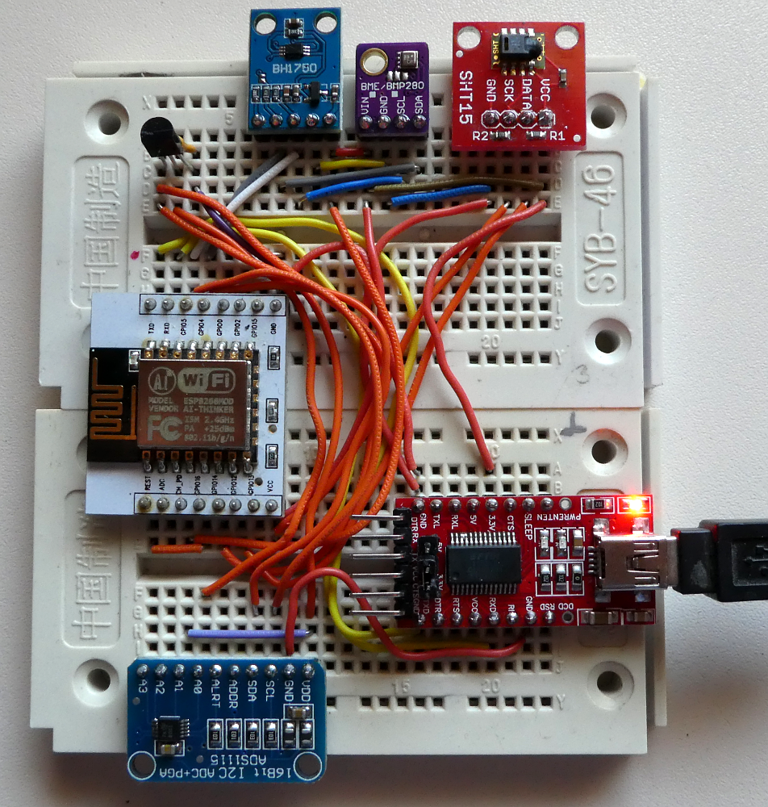
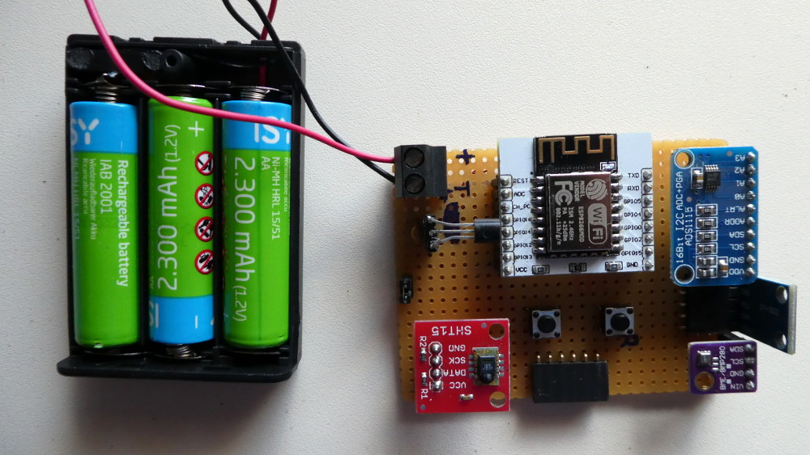
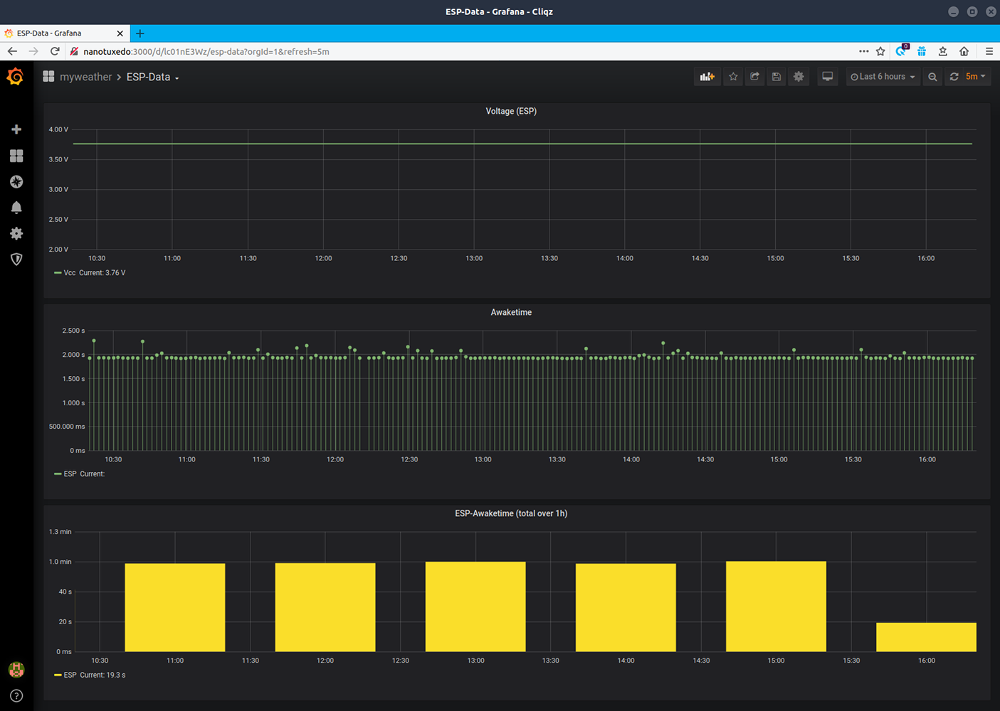

# Sensor-Modul
## Aufbau
Als zentrale Verarbeitungseinheit wurde ein ESP8266-12 (also ohne Spannungsregler, Serial2USB-Umsetzer etc., wegen deren zusätzlichem/unnötigen Stromverbrauch) verwendet. Folgende Sensoren sind (derzeit) angeschlossen:

* TMP36 (Temperatur)
* SHT15 (Temperatur, Luftfeuchtigkeit)
* BME280 (Temperatur, Luftfeuchtigkeit, Luftdruck)
* BH1750 (Helligkeit)

Zur Digitalisierung des analogen Temperaturmesswertes des TMP36 und der Versorgungsspannungen wird ein ADS1115-ADC-Modul verwendet.

## Firmware
Die Firmware liegt in zwei Versionen vor:

* [unoptimierte Variante](esp8266_without_optimization/) 
* [optimierte (Stromverbrauch/Verarbeitungzeit) Variante](esp8266_with_optimization/)

Die optimierte Variante arbeitet grob in folgenden Schritten:

* Modul wacht auf...
* Deaktivierung des Wifi-Moduls
* Auslesen der letzten Wifi-Konfiguration (Kanal, MAC-Adresse des AP) aus dem RTC des ESP
* Lesen der Konfiguration (WLAN, IP, MQTT, etc.) aus dem Flash des ESP
* Initialisierung der Sensoren
* Auslesen der Sensoren
* Wifi-Verbindung herstellen (wenn möglich mit letztem bekannten AP und fester IP-Konfiguration; also kein DHCP, was Zeit kostet!)
* Verbindung zum MQTT-Broker herstellen
* MQTT-Nachricht mit den Sensorwerten senden
* ESP für eine definierte Zeit in Tiefschlaf versetzen

Zu Beginn einzelner interessanter Programmabschnitte wird jeweils ein Impuls an einem GPIO-Pin des ESP ausgegeben. Diese Impulse werden vom  verarbeitet.

## Minimierung Verarbeitungzeit und Stromverbrauch
Die Wachzeit des ESP8266 liegt im Durchschnitt bei knapp 2s. Die konnte vor allem dadurch erreicht werden, dass die Verarbeitungszeiten zum Herstellen einer Wifi-Verbindung minimiert wurden (siehe oben). Da das Wifi-Modem einer der größten Stromverbraucher innerhalb des ESP8266 ist, hat dies auch einen entscheidenden Einfluss auf die Stromaufnahme. Zwei repräsentative Messungen der Stromaufnahme (in mA) über die Zeit (im 1ms-Raster) sind [hier als csv-Datei](../esp_ammeter/data/) zu finden.

## Bilder
Aufbau auf einem Breadboard (Stromversorung noch über den Serial-USB-Wandler...):

...auf Lochrasterplatine (Stromversorgung über 3 NiMH-Akkus; ungeregelt):

...Diagramme, die u.a den Verlauf der Wachzeiten des ESP8266 aufzeigen:

---------
Have fun!

Uwe Berger; 2020
